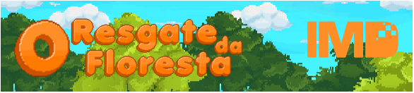
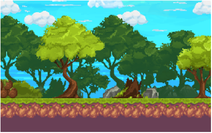
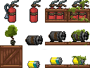
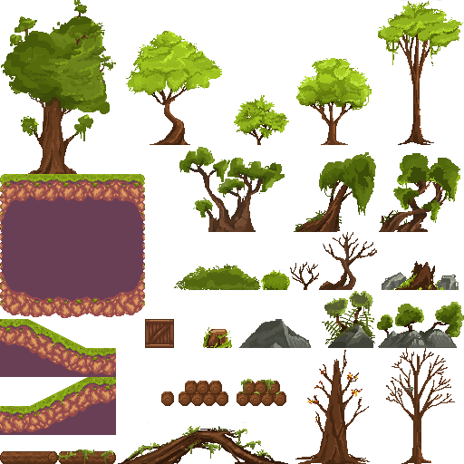
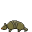

  

<h1 align = "center">
  Desafio GameEdu 2020: O Resgate da Floresta
  

    
    
  

</h1>

<a href= "#sobre-este-projeto">👨🏻‍💻 Sobre este projeto</a> &nbsp;&nbsp;&nbsp;|&nbsp;&nbsp;&nbsp;
<a href="#historia-e-gameplay">🕹️ História e Gameplay</a> &nbsp;&nbsp;&nbsp;|&nbsp;&nbsp;&nbsp;
<a href="#elementos-graficos">🖼️ Elementos gráficos</a>

<h2 id = "sobre-este-projeto">👨🏻‍💻 Sobre este projeto </h2>

Desenvolvido para o Desafio GameEdu 2020, o jogo “O Resgate da Floresta” fundamenta-se nos Objetivos 13 e 15 da Agenda 2030 da ONU para o desenvolvimento sustentável, sendo eles respectivamente a “Ação Contra a Mudança Global do Clima” e a “Vida Terrestre”, que trazem como metas proteger, recuperar e promover o uso sustentável dos ecossistemas terrestres, além de gerir de forma sustentável as florestas e combater a degradação e o desmatamento, com o intuito de combater as mudanças climáticas e seus impactos.

O game “O Resgate da Floresta” é um jogo de Plataforma no estilo 2D Pixel Art inteiramente ambientado na Floresta Amazônica, desenvolvido utilizando o Unity v2017 e com elementos de arte editados utilizando o software Krita e o site Piskelapp.com.

[Acesse o GDD](documents/O_Resgate_da_Flroesta-GDD.pdf)

<h2 id = "historia-e-gameplay">🕹️ História e Gameplay</h2>

Em um mundo onde o consumo desenfreado e a extração descontrolada de recursos se tornaram comum, surgiram certas organizações independentes com a finalidade de restaurar a fauna e flora da região onde atuam, para que assim possam salvar o planeta do grande aquecimento global.

O soldado Pereira, integrante de uma dessas instituições que atua na Floresta Amazônica, recebe de seus supervisores a missão de limpar e recuperar a floresta após à notícia de acampamentos e avistamentos de grandes áreas desmatadas serem divulgados nos noticiários.

Também chamado de Ednaldo, Pereira recebe a missão de limpar a floresta e coletar todos os equipamentos deixados para trás por estes acampamentos em todas as 3 matas da floresta amazônica, iniciando sua jornada na Mata de igapó, passando pela Mata de Várzea e finalizando seu trabalho na Mata de Terra Firme.

Além da limpeza, o player deve ter extremo cuidado para não maltratar os animais da fauna local, sob pena de ser demitido imediatamente do trabalho atual, por maus tratos com os animais. O jogador também leva consigo um extintor de incêndio, para apagar os focos de incêndio causados pelos equipamentos e lixo deixado no local.

<h2 id = "elementos-graficos">🖼️ Elementos gráficos</h2>

O jogo é inteiramente ambientado na Floresta Amazônica, onde a primeira fase acontece na Mata de Igapó, a segunda na Mata de Várzea e a terceira fase a se passa na Mata de Terra Firme, proporcionando uma progressão a medida em que o personagem adentra na floresta, modificando o cenário em cada ambiente. 

O cenário é constituído de árvores características de cada região e alguns itens coláveis como caixas, motores, baterias, extintores usados e lixo, deixados por criminosos que desmataram a floresta naquela região. O ecossistema do jogo também é constituído de animais como cobras, tatus e escorpiões que representam parte da fauna local.

<h3 align="center">Exemplo de vegetação da Mata de Várzea</h3>

     

<h3 align="center">Tilemap dos itens</h3>

     

<h3 align="center">Composição do cenário</h3>

     

<h2 id="licenca">📝 Licença</h2>

- Este projeto está sob a licença [MIT](https://github.com/Arco-de-Treinamento/Desafio_GameEdu_2020/blob/main/LICENSE).

  

  
  👋🏾 Feito por [JosManoel](https://github.com/JosManoel) com 🕹️ , 🎧 e 💻.

 
